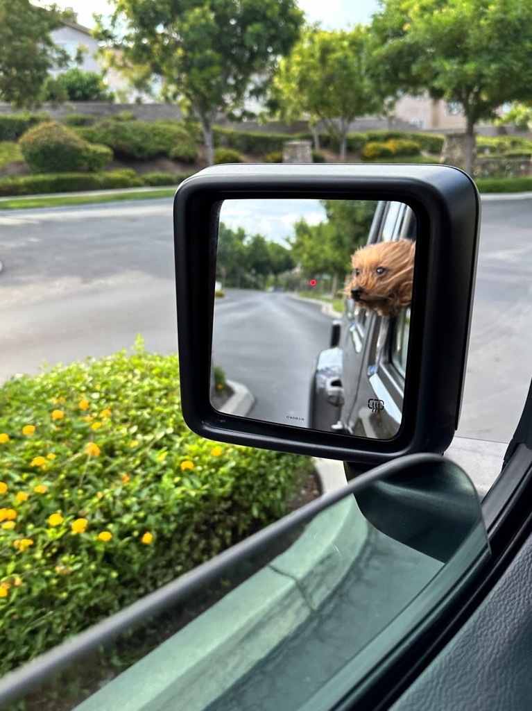
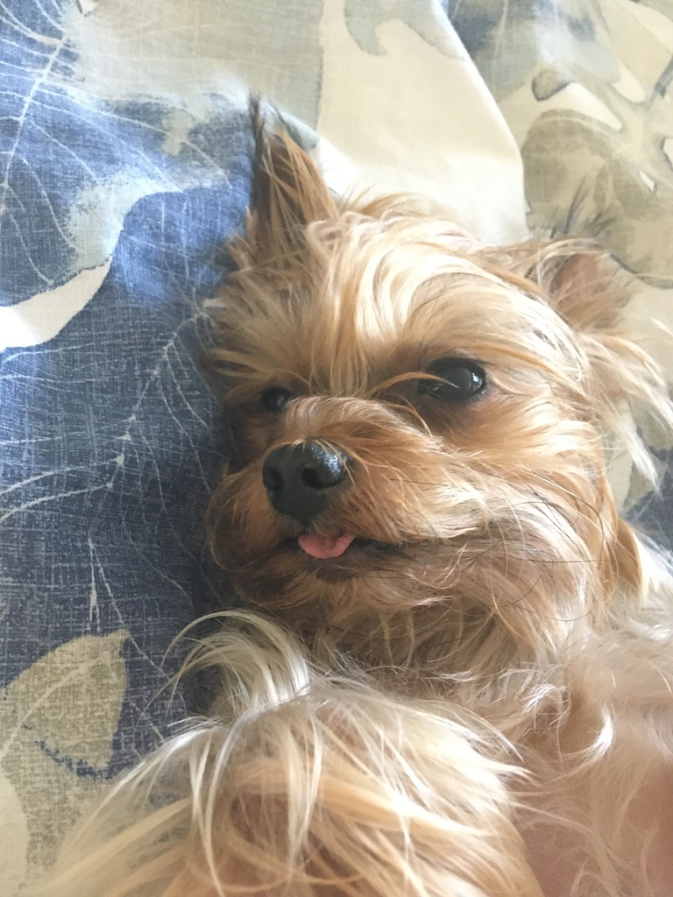

# Why Sprinkles is a baddie
**Sprinkles** (my very old & geriatric [Yorkshire Terrier](https://en.wikipedia.org/wiki/Yorkshire_Terrier)) is the best dog anyone could have and I'm very grateful to have her as my silly dog
Link to images of sprinkles : [pictures of Sprinkles](#pictures-of-sprinkles)
## Permaderp
Sprinkles has a [permaderp](CA9D1C01-538B-4B90-92AC-324AB7DB35FD_1_201_a.jpeg) (her tongue is almost always sticking out) and it makes her look very cute and funny
### No teeth
Sprinkles has no teeth since she is old so her tongue is always slipping out
## Wont bite ppl
Since Sprinkles is toothless she also wont bite people and instead shows everyone lots of love
## Extra cuddly
Like all other Yorkshire Terriers<sub>TM</sub> Sprinkles has ***hair*** not ***fur*** so she is extra soft and won't shed
## Opinions on Sprinkles
Of course _I'm_ not the only one who thinks this
Here's what others have to say about why Sprinkles is the best:
> "Because she is so adorable, she is like a living plushie, she loves to cuddle and makes you feel loved!" - My dad

## Pictures of Sprinkles
Here are some new and old pictures of Sprinkles in her different eras:


## Final Takeaways
Sprinkles is the best dog ever because:
* she is cute
* she wont bite anyone
* she is cuddly
In my opinion here are the best type of dog breeds:(since sprinkles is one of a kind there isnt a sprinkles breed)
1. Yorkshire Terrier
2. Maltese
3. Daschund (sausage dog)
## What to do if you encounter Sprinkles
If you ever encounter Sprinkles here is you should do to make the best impression:
[] let her sniff you
[] give her some fruit
[] be kind 
## Technical stuff
I used the following git commands
```
git status
git add
git commit
```
